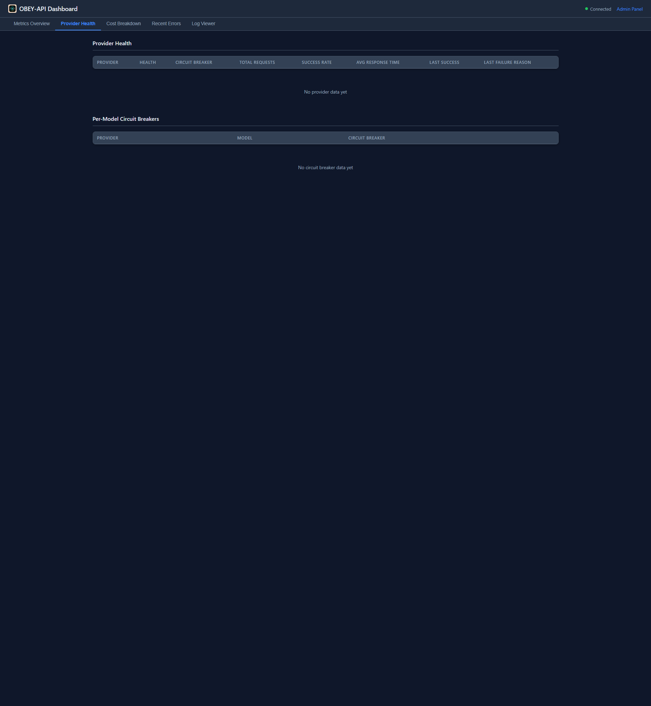
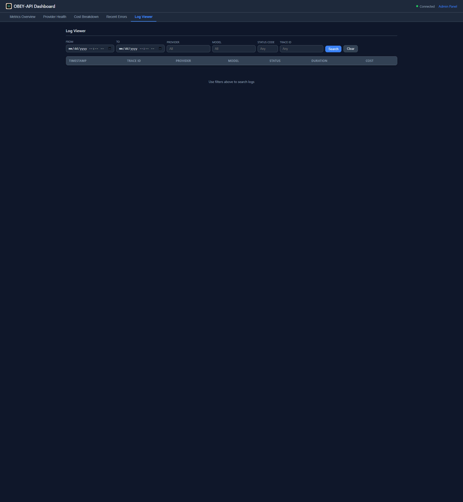

# Admin Panel & Dashboard

OBEY API Gateway ships with two embedded web UIs — an Admin Panel for configuration management and a real-time Dashboard for monitoring.

---

## Admin Panel

The Admin Panel provides a visual interface for managing all gateway configuration without editing YAML files.

**URL:** `http://localhost:8080/admin` (configurable via `admin.path`)


### Tabs

| Tab | Purpose |
|-----|---------|
| **Server Settings** | Host, port, timeouts, TLS, admin auth |
| **Providers** | Add/edit/remove providers, configure API keys |
| **Model Groups** | Define model groups and priority ordering |
| **Routing Settings** | CORS, request handling |
| **Circuit Breaker** | Failure thresholds, backoff sequences |
| **Logging** | Log levels, retention, body logging |
| **Caching** | Exact cache and semantic cache settings |
| **Context** | Context window management settings |
| **Streaming** | SSE reliability configuration |
| **Virtual Keys** | Key creation, management, usage tracking |
| **Guardrails** | Pipeline configuration, provider setup |

### Configuration Actions

| Button | Action |
|--------|--------|
| **Save** | Validate and apply changes (hot-reload) |
| **Reset** | Revert form to current saved state |
| **Reload Config** | Re-read config.yaml from disk |
| **Export YAML** | Download current config as YAML file |
| **Import YAML** | Upload and apply a YAML config file |

### Authentication

```yaml
admin:
  enabled: true
  path: "/admin"
  auth:
    enabled: true
    username_env: "ADMIN_USERNAME"    # Env var name
    password_env: "ADMIN_PASSWORD"    # Env var name
```

When auth is enabled, all admin endpoints require HTTP Basic Auth. Credentials are resolved from environment variables at runtime.

---

## Dashboard

The Dashboard provides real-time metrics, provider health, and log viewing via WebSocket updates.

**URL:** `http://localhost:8080/dashboard` (configurable via `dashboard.path`)


### Tabs

| Tab | Purpose |
|-----|---------|
| **Metrics Overview** | Total requests, avg response time, request rate, active requests, cost, cache hit rate |
| **Provider Health** | Per-provider circuit breaker status, latency, error rates |
| **Cost Breakdown** | Spending by provider and model |
| **Recent Errors** | Latest error logs with details |
| **Log Viewer** | Searchable, filterable request log table |

### Real-Time Metrics

The dashboard connects via WebSocket for live updates (configurable interval):

```yaml
dashboard:
  enabled: true
  path: "/dashboard"
  metrics_update_interval_seconds: 1
```

### Metrics Cards

| Metric | Description |
|--------|-------------|
| **Total Requests** | Cumulative request count since startup |
| **Avg Response Time** | Rolling average latency |
| **Request Rate** | Requests per minute |
| **Active Requests** | Currently in-flight requests |
| **Cumulative Cost** | Total USD spend across all providers |
| **Cache Hit Rate** | `N/A` until first eligible request, then percentage |

### Provider Health



Shows per-provider:
- Circuit breaker state (Closed/Open/Half-Open)
- Average latency
- Error rate
- Request count

### Log Viewer



Features:
- Filter by date range, provider, model, status code, trace ID
- Configurable result limit
- Request/response body viewing (when body logging enabled)

---

## Admin API Endpoints

All admin functionality is also available programmatically:

### Configuration

```bash
# Get current config
curl http://localhost:8080/admin/config

# Update config (validate + write + apply)
curl -X PUT http://localhost:8080/admin/config \
  -H 'Content-Type: application/json' \
  -d '{ ... }'

# Validate without applying
curl -X POST http://localhost:8080/admin/config/validate \
  -H 'Content-Type: application/json' \
  -d '{ ... }'

# Hot-reload from disk
curl -X POST http://localhost:8080/admin/config/reload

# Export YAML
curl http://localhost:8080/admin/config/export

# Import YAML
curl -X POST http://localhost:8080/admin/config/import \
  -H 'Content-Type: application/yaml' \
  --data-binary @config.yaml
```

### Virtual Keys

```bash
curl http://localhost:8080/admin/keys              # List
curl -X POST http://localhost:8080/admin/keys      # Create
curl http://localhost:8080/admin/keys/{id}         # Get
curl -X PATCH http://localhost:8080/admin/keys/{id} # Update
curl -X POST http://localhost:8080/admin/keys/{id}/revoke  # Revoke
curl -X DELETE http://localhost:8080/admin/keys/{id}        # Delete
```

### OAuth

```bash
curl -X POST http://localhost:8080/admin/oauth/openai/login   # Start login
curl http://localhost:8080/admin/oauth/openai/status           # Check status
curl -X POST http://localhost:8080/admin/oauth/openai/logout   # Logout
```

### Dashboard Data

```bash
curl http://localhost:8080/dashboard/metrics   # Current metrics snapshot
curl http://localhost:8080/dashboard/errors    # Recent errors
curl "http://localhost:8080/dashboard/logs?limit=100&provider=openai"  # Filtered logs
```

---

## Hot Reload

Configuration can be changed and applied without restarting the gateway:

1. **Via Admin Panel** — edit settings and click Save
2. **Via API** — `POST /admin/config/reload` to re-read from disk
3. **Via PUT** — `PUT /admin/config` to validate, save, and apply in one call

On reload:
- All circuit breakers are reset
- New provider settings take effect immediately
- Active requests complete with old settings

---

## Prometheus Metrics

For integration with existing monitoring infrastructure:

```yaml
prometheus:
  enabled: true
  path: "/metrics"
```

Exposes standard Prometheus text format at `http://localhost:8080/metrics`.

Key metrics include:
- `obey_api_requests_total{provider, model, status}`
- `obey_api_request_duration_seconds{provider, model}`
- `obey_api_cache_hits_total{tier}`
- `obey_api_circuit_breaker_state{provider}`
- `obey_api_guardrail_stage_executions_total{pipeline, stage, provider, action}`
- `obey_api_guardrail_stage_latency_ms{pipeline, stage, provider}`

---

## Next Steps

- [Configuration](Configuration) — full config reference
- [Virtual Keys](Virtual-Keys) — key management details
- [Guardrail Pipelines](Guardrail-Pipelines) — policy enforcement
