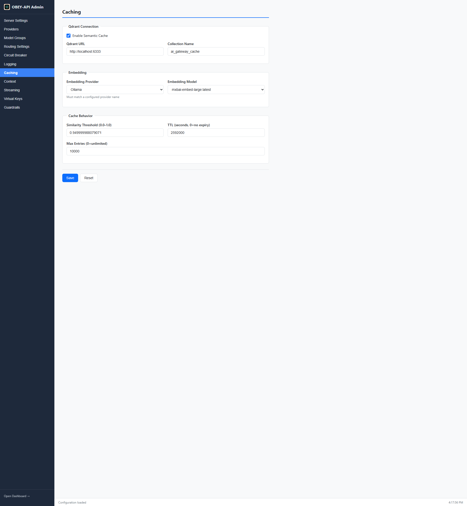

# Caching

OBEY API Gateway includes a built-in two-tier response cache for chat completions. Both tiers serve streaming and non-streaming callers from the same entries.

---

## Cache Architecture

```
Request ──▶ Tier 1: Exact Match (in-memory) ──hit──▶ Response
                    │
                  miss
                    │
                    ▼
             Tier 2: Semantic (Qdrant) ──hit──▶ Response
                    │
                  miss
                    │
                    ▼
             Forward to Provider ──▶ Store in cache ──▶ Response
```

| Tier | Backend | Default State | Best For |
|------|---------|:-------------:|----------|
| **1 — Exact** | In-memory `DashMap`, SHA-256 keyed | **Enabled** | Byte-identical retries, agent loops, dedup |
| **2 — Semantic** | Qdrant + embedding provider | Disabled | Paraphrased / near-identical prompts |

---

## Tier 1: Exact-Match Cache

Zero-setup in-memory cache that works out of the box.

### Configuration

```yaml
exact_cache:
  enabled: true
  max_entries: 5000           # Oldest-first eviction above this
  ttl_seconds: 3600           # Entry lifetime (1 hour default)
  temperature_threshold: 0.15 # Max temperature for eligibility
```

### How It Works

- **Key**: SHA-256 hash of `model` + `messages` + `tools` + `tool_choice` + `response_format` + `top_p` + `frequency_penalty` + `presence_penalty` + `stop` + `seed` + `n` + `max_tokens`
- **Excluded from key**: `stream` flag, `user`, request-id, trace-id (transport metadata)
- **Eviction**: Oldest-first when `max_entries` is exceeded

### Admin UI



---

## Tier 2: Semantic Cache

Optional similarity-based cache that catches paraphrased requests. Requires [Qdrant](https://qdrant.tech/) vector database and an embedding provider.

### Configuration

```yaml
semantic_cache:
  enabled: true
  qdrant_url: "http://localhost:6334"     # gRPC port (not 6333 REST)
  collection_name: "ai_gateway_cache"
  similarity_threshold: 0.95              # 0.0–1.0, higher = stricter matching
  embedding_provider: "openai"            # Must match a configured provider name
  embedding_model: "text-embedding-3-small"
  ttl_seconds: 3600
  max_cache_size: 10000
```

### How It Works

1. Request messages are embedded using the configured embedding model
2. Qdrant searches for vectors with similarity >= `similarity_threshold`
3. On hit: cached response returned immediately
4. On miss: request forwarded, response embedded and stored

### Qdrant Setup

```bash
# Docker (quickest)
docker run -d --name qdrant -p 6333:6333 -p 6334:6334 qdrant/qdrant

# Or use Qdrant Cloud: https://cloud.qdrant.io
```

---

## Cache Eligibility

Both tiers share the same eligibility rules:

### Request Must Match

| Condition | Rule |
|-----------|------|
| Temperature | `<= temperature_threshold` (default `0.15`) |
| N (number of completions) | Must be `1` |
| Tool requests | Cached in Tier 1 only; skipped in Tier 2 |

Higher temperatures imply non-determinism and are skipped to avoid replaying randomized output.

### Response Must Not Contain

| Condition | Reason |
|-----------|--------|
| `tool_calls` in response | Tool use varies by context |
| `finish_reason: length` | Truncated responses shouldn't be cached |
| `finish_reason: content_filter` | Filtered responses are contextual |

---

## Cache Key Details

The cache key includes everything that affects the response:

**Included:**
- `model`
- Full `messages` array
- `tools` and `tool_choice`
- `response_format`
- `top_p`, `frequency_penalty`, `presence_penalty`
- `stop` sequences
- `seed`, `n`, `max_tokens`

**Excluded (intentionally):**
- `stream` flag — same entry serves both streaming and non-streaming
- `user` field — transport metadata
- Request ID / trace ID — per-request metadata

---

## Streaming + Cache Interaction

The `stream` flag is excluded from the cache key, so:

- A cached non-streaming response is re-chunked into SSE events for streaming callers
- A response originally received via streaming serves non-streaming callers as a complete JSON body
- Cache hits skip the early synthetic event (response starts immediately)

---

## Dashboard Indicator

The dashboard's **Cache Hit Rate** card:
- Shows `N/A` until the first eligible request is observed
- Then displays a percentage (hits / total eligible requests)

To test caching, send the same request twice with `temperature: 0` (or omit it):

```bash
# First call: cache miss (forwarded to provider)
curl http://localhost:8080/v1/chat/completions \
  -H "Content-Type: application/json" \
  -d '{"model":"gpt-4-group","messages":[{"role":"user","content":"Hello"}],"temperature":0}'

# Second call: cache hit (instant response)
curl http://localhost:8080/v1/chat/completions \
  -H "Content-Type: application/json" \
  -d '{"model":"gpt-4-group","messages":[{"role":"user","content":"Hello"}],"temperature":0}'
```

---

## Next Steps

- [Streaming](Streaming) — how streaming interacts with caching
- [Configuration](Configuration) — full config reference
- [Admin Panel & Dashboard](Admin-Panel-and-Dashboard) — monitor cache hit rate
