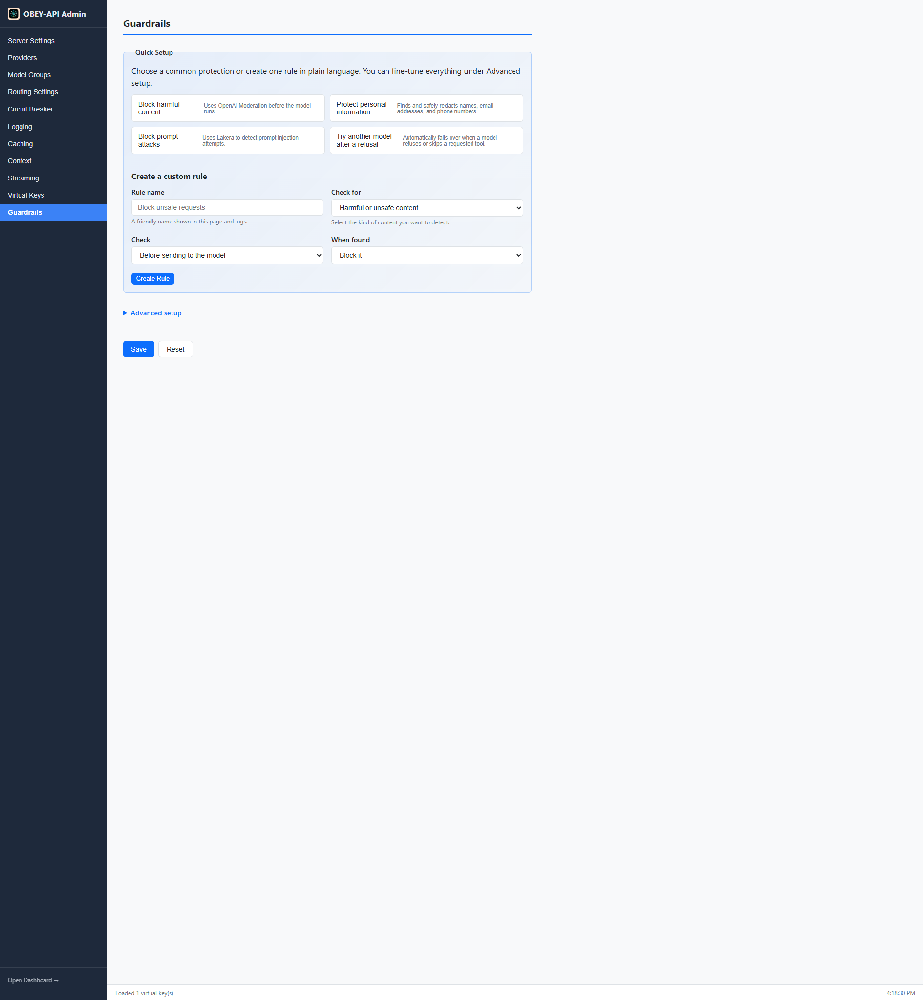

# Guardrail Pipelines

Guardrail Pipelines add a configurable policy-enforcement layer that intercepts requests before provider routing (pre-call) and responses before returning to the caller (post-call). Use them for PII/DLP filtering, content moderation, semantic prompt guarding, and sensitive data redaction with transparent re-injection.

---

## Overview

```
Client Request
      │
      ▼
┌─────────────────┐
│  PRE-CALL       │  ← PII redaction, secret scanning, injection detection
│  Pipeline       │
└────────┬────────┘
         │ (redacted request)
         ▼
┌─────────────────┐
│  Router /       │  ← Normal provider routing with failover
│  Provider       │
└────────┬────────┘
         │ (raw response)
         ▼
┌─────────────────┐
│  POST-CALL      │  ← Output filtering, PII re-injection
│  Pipeline       │
└────────┬────────┘
         │ (clean response)
         ▼
    Client Response
```

---

## Guardrail Providers

| Type | Description |
|------|-------------|
| `regex` | Up to 256 named patterns with allow/deny modes; compiled at load time, per-pattern 10ms budget |
| `presidio` | Presidio-compatible NLP PII detection via HTTP; configurable entity types and confidence threshold |
| `openai_moderation` | OpenAI Moderation API integration |
| `lakera` | Lakera Guard prompt injection detection |
| `semantic` | Embedding-based similarity matching against allow/deny example collections in Qdrant |
| `custom_http` | POST content to any HTTP endpoint implementing the documented findings JSON schema |

---

## Policy Actions

| Action | Pre-Call | Post-Call | Behavior |
|--------|:--------:|:---------:|----------|
| `allow` | ✓ | ✓ | Pass through unmodified |
| `block` | ✓ | ✓ | Reject with HTTP 403 |
| `mask` | ✓ | | Replace each character with `*`, preserving byte length |
| `redact` | ✓ | ✓ | Replace with placeholder tokens (pre-call) or `[REDACTED]` (post-call) |
| `replace_with_policy_message` | | ✓ | Replace assistant content with a configured message |

---

## Configuration Example

```yaml
guardrails:
  providers:
    - name: secret-scanner
      type: regex
      failure_policy: fail_close
      patterns:
        - { name: openai_key, regex: "sk-[A-Za-z0-9]{20,}", entity: API_KEY, mode: deny }
        - { name: aws_key, regex: "AKIA[0-9A-Z]{16}", entity: AWS_KEY, mode: deny }

    - name: pii-detector
      type: presidio
      failure_policy: fail_open
      endpoint: "http://presidio:3000/analyze"
      entities: [EMAIL_ADDRESS, US_SSN, CREDIT_CARD]
      confidence_threshold: 0.6

    - name: prompt-guard
      type: semantic
      failure_policy: fail_open
      allow_collection: "guardrail_allow"
      deny_collection: "guardrail_deny"
      allow_threshold: 0.90
      deny_threshold: 0.85

  pipelines:
    - name: standard
      failover_on_refusal: true
      stages:
        - { name: pii-redact, provider: pii-detector, phase: pre_call, action: redact }
        - { name: secret-block, provider: secret-scanner, phase: pre_call, action: block }
        - { name: injection-guard, provider: prompt-guard, phase: pre_call, action: block }
        - { name: out-redact, provider: secret-scanner, phase: post_call, action: redact }

  global_default_pipeline: standard

  bindings:
    virtual_keys:
      vk_team_a: standard
    model_groups:
      gpt-4-group: standard
    routes:
      "/v1/chat/completions": standard
```

### Admin UI



---

## PII Redaction & Re-Injection

When a pre-call stage uses the `redact` action, detected PII is replaced with deterministic placeholder tokens before the request reaches the LLM:

```
User: "Contact me at john@example.com or 555-0123"
     ↓ (redacted)
LLM sees: "Contact me at <<PII_EMAIL_1>> or <<PII_PHONE_1>>"
     ↓ (LLM responds)
LLM output: "I'll reach out to <<PII_EMAIL_1>>"
     ↓ (re-injected)
Client receives: "I'll reach out to john@example.com"
```

### How It Works

1. PII values are replaced with `<<PII_TYPE_N>>` placeholders
2. A system instruction is prepended telling the model to preserve placeholders verbatim
3. After the LLM responds, placeholders are restored to original values

### Limits and Behavior

- Up to 256 distinct values per request receive re-injection entries
- Identical values reuse the same placeholder (deduplication)
- Configurable redaction-notice instruction text and insertion mode (`separate` or `merged`)
- The re-injection map is held only in memory for the request duration

---

## Refusal Detection & Failover

The gateway detects when a model refuses a request and optionally fails over:

### Detection Signals

| Signal | Description |
|--------|-------------|
| **Phrase matching** | Case-insensitive regex patterns against assistant content (default list + configurable) |
| **Tool-omission** | Tools were provided but the model didn't call any |

### Failover Behavior

- Re-dispatches the already-redacted request to the next eligible target
- Skips providers with open circuit breakers
- Each provider attempted at most once
- Toggle: `failover_on_refusal` per-pipeline or per-binding (disabled by default)

---

## Pipeline Ordering

When multiple pipelines apply (global + virtual-key + model-group + route), stages concatenate in a fixed order:

1. Global default pipeline stages
2. Virtual-key pipeline stages
3. Model-group pipeline stages
4. Route pipeline stages

**Halting actions** (`block`, `replace_with_policy_message`) short-circuit immediately. Non-halting actions continue to the next stage.

---

## Failure Policies

Each provider must declare a `failure_policy`:

| Policy | Behavior |
|--------|----------|
| `fail_open` | On timeout or error, skip the stage and continue |
| `fail_close` | On timeout or error, halt pipeline and return HTTP 503 |

---

## Streaming Support

For SSE responses with a post-call pipeline:

1. Gateway buffers the streamed response (up to 10 MB)
2. Sends keep-alive comments during buffering
3. Applies guardrail analysis on the assembled content
4. Re-chunks the result into SSE events matching original chunk boundaries

---

## Observability

Guardrail execution is fully observable via Prometheus:

| Metric | Description |
|--------|-------------|
| `obey_api_guardrail_stage_executions_total{pipeline, stage, provider, action}` | Stage execution counter |
| `obey_api_guardrail_stage_latency_ms{pipeline, stage, provider}` | Latency histogram (buckets: 5–5000ms) |
| `obey_api_guardrail_refusal_detected_total{pipeline, signal}` | Refusal detection counter |

---

## Next Steps

- [Virtual Keys](Virtual-Keys) — bind pipelines to specific callers
- [Security](Security) — encryption and secrets management
- [Providers](Providers) — provider configuration
