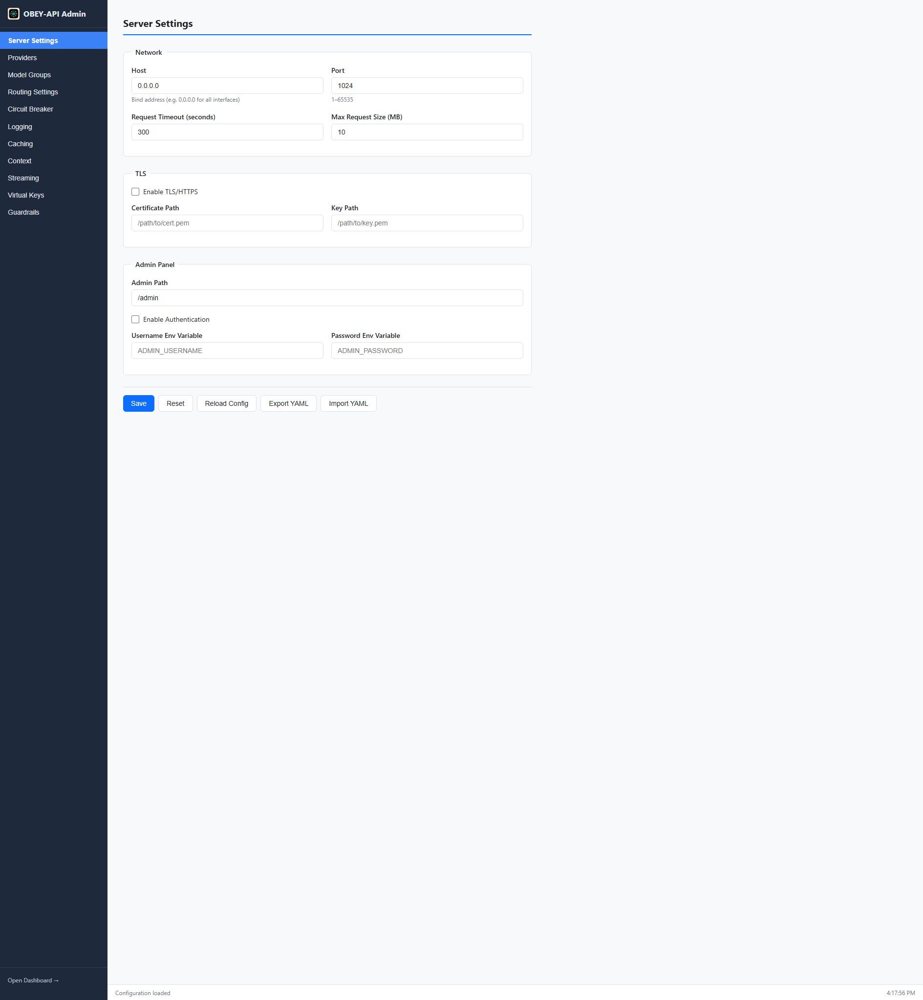

# OBEY API Gateway

<p align="center">
  
</p>

**OpenAI-compatible AI gateway with intelligent routing, automatic failover, and multi-provider support.**

Single Rust binary. No runtime dependencies. Just download and run.

---

## What is OBEY API Gateway?

OBEY API Gateway sits between your application and your AI providers. Point your existing OpenAI SDK at it instead of `api.openai.com`, and you get automatic failover, circuit breakers, and multi-provider routing — without changing your application code.

AI providers go down. Rate limits hit. Models get deprecated. OBEY handles all of that transparently.

---

## Key Features at a Glance

| Feature | Description |
|---------|-------------|
| [Drop-in OpenAI Replacement](Providers) | Full `/v1/*` API compatibility (chat, completions, embeddings, images, audio, assistants) |
| [Multi-Provider Routing](Routing-and-Failover) | OpenAI, Ollama, AWS Bedrock, Groq, Together AI, NVIDIA NIM, vLLM, LM Studio |
| [Automatic Failover](Routing-and-Failover) | Circuit breakers + retry with exponential backoff across providers |
| [Smart Rate-Limit Handling](Routing-and-Failover#smart-rate-limit-failover) | Honors `Retry-After`, `X-RateLimit-Reset`, Anthropic headers, weekly quotas |
| [Streaming Reliability](Streaming) | True SSE pass-through, early events, keep-alive, mid-stream failover |
| [Response Caching](Caching) | Two-tier: in-memory exact-match + optional Qdrant semantic cache |
| [Token Compression](Token-Compression) | Multi-engine payload compression with custom pipelines and cache-aware downgrades |
| [Virtual Key Management](Virtual-Keys) | Per-caller keys with budgets, rate limits, model access, expiry |
| [Guardrail Pipelines](Guardrail-Pipelines) | PII redaction, content moderation, prompt injection detection |
| [OpenAI OAuth Login](OAuth-and-Codex) | Browser-based sign-in with ChatGPT Plus/Pro subscription |
| [Codex Backend](OAuth-and-Codex#codex-backend-translation) | Routes OAuth requests through ChatGPT Codex, translating APIs on the fly |
| [Admin Panel & Dashboard](Admin-Panel-and-Dashboard) | Embedded web UIs for config, metrics, and logs |
| [Encrypted Key Storage](Security#encrypted-api-key-storage) | Provider keys encrypted at rest with machine-local master key |
| [TLS Support](Security#tls-configuration) | Optional HTTPS with certificate configuration |
| [Windows System Tray](Installation#option-1-download-windows) | Desktop app with splash screen and tray menu |
| [Hot Config Reload](Admin-Panel-and-Dashboard#hot-reload) | Change settings via admin UI without restarting |
| [Prometheus Metrics](Admin-Panel-and-Dashboard#prometheus-metrics) | `/metrics` endpoint for monitoring infrastructure |

---

## Quick Start

```bash
# Point any OpenAI-compatible SDK at the gateway
export OPENAI_API_BASE=http://localhost:8080/v1
```

```python
from openai import OpenAI

client = OpenAI(base_url="http://localhost:8080/v1", api_key="unused")
response = client.chat.completions.create(
    model="gpt-4-group",  # Use your model group name
    messages=[{"role": "user", "content": "Hello!"}]
)
```

See [Installation](Installation) for all setup options.

---

## Architecture Overview

```
┌─────────────────┐     ┌──────────────────────────────────────────────────┐
│  Your App /     │     │              OBEY API Gateway                     │
│  OpenAI SDK     │────▶│                                                  │
│                 │     │  ┌──────────┐  ┌──────────┐  ┌───────────────┐  │
└─────────────────┘     │  │ Guardrail│─▶│  Router  │─▶│   Providers   │  │
                        │  │ Pipeline │  │(failover)│  │               │  │
                        │  └──────────┘  └──────────┘  │ ┌───────────┐ │  │
                        │                              │ │  OpenAI   │ │  │
                        │  ┌──────────┐  ┌──────────┐  │ ├───────────┤ │  │
                        │  │  Cache   │  │  Circuit │  │ │  Ollama   │ │  │
                        │  │(2-tier)  │  │ Breakers │  │ ├───────────┤ │  │
                        │  └──────────┘  └──────────┘  │ │  Bedrock  │ │  │
                        │                              │ ├───────────┤ │  │
                        │  ┌──────────┐  ┌──────────┐  │ │  Groq     │ │  │
                        │  │ Virtual  │  │   Rate   │  │ ├───────────┤ │  │
                        │  │  Keys    │  │ Limiters │  │ │ Together  │ │  │
                        │  └──────────┘  └──────────┘  │ └───────────┘ │  │
                        │                              └───────────────┘  │
                        └──────────────────────────────────────────────────┘
```

---

## Screenshots

### Dashboard


### Admin Panel


---

## Wiki Navigation

- **[Installation](Installation)** — Download, Docker, Railway, build from source
- **[Configuration](Configuration)** — Full config reference, environment variables
- **[Providers](Providers)** — Supported providers and their setup
- **[Routing & Failover](Routing-and-Failover)** — Intelligent routing, circuit breakers, priorities
- **[Streaming](Streaming)** — Streaming reliability features
- **[Caching](Caching)** — Exact-match and semantic cache
- **[Token Compression](Token-Compression)** — Multi-engine payload compression
- **[Virtual Keys](Virtual-Keys)** — Multi-tenant key management
- **[Guardrail Pipelines](Guardrail-Pipelines)** — Policy enforcement and PII protection
- **[OAuth & Codex](OAuth-and-Codex)** — OpenAI OAuth and Codex backend
- **[Admin Panel & Dashboard](Admin-Panel-and-Dashboard)** — Web UIs, API, metrics
- **[Security](Security)** — Encryption, TLS, secrets management

---

## Links

- [GitHub Repository](https://github.com/fdanobey/OBEY-api-gateway)
- [Latest Release](https://github.com/fdanobey/OBEY-api-gateway/releases/latest)
- [Report an Issue](https://github.com/fdanobey/OBEY-api-gateway/issues)
