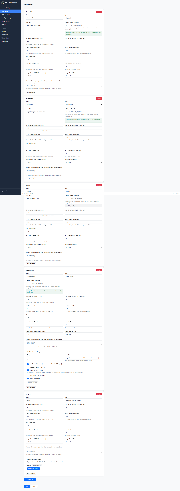

# Providers

OBEY API Gateway supports multiple AI providers through a unified OpenAI-compatible interface. Configure one or more providers to enable intelligent routing, failover, and load balancing.

---

## Supported Provider Types

| Type | Provider | API Key Required | Notes |
|------|----------|:----------------:|-------|
| `openai` | OpenAI, Nano-GPT, any OpenAI-compatible API | Yes | Generic OpenAI protocol |
| `ollama` | Ollama | No | Local models, no API key needed |
| `bedrock` | AWS Bedrock | Varies | API key or AWS SDK auth |
| `groq` | Groq | Yes | |
| `together` | Together AI | Yes | |
| `nvidia_nim` | NVIDIA NIM | Yes | |
| `vllm` | vLLM | No | Self-hosted inference |
| `lmstudio` | LM Studio | No | Local models |

---

## Managing Providers in the Admin UI

The Admin Panel provides a visual interface for adding and configuring providers:



---

## Common Provider Fields

All providers share these configuration fields:

```yaml
providers:
  - name: "my-provider"              # Unique identifier (referenced in model_groups)
    type: "openai"                   # Provider type (see table above)
    base_url: "https://..."          # Provider API endpoint
    api_key_env: "MY_API_KEY"        # Env var name for the API key
    timeout_seconds: 30              # Legacy total timeout
    ttfb_timeout_seconds: 30         # Time-to-first-byte timeout
    total_timeout_seconds: 300       # Total round-trip timeout
    max_connections: 100             # Connection pool limit
    rate_limit_per_minute: 60        # Per-provider RPM (0 = unlimited)
    custom_headers:                  # Optional extra headers
      X-Custom: "${MY_ENV_VAR}"      # Supports env var substitution
```

---

## OpenAI

Standard OpenAI or any OpenAI-compatible API (Nano-GPT, OpenRouter, etc.).

```yaml
providers:
  - name: "openai"
    type: "openai"
    base_url: "https://api.openai.com/v1"
    api_key_env: "OPENAI_API_KEY"
    timeout_seconds: 30
    max_connections: 100
    rate_limit_per_minute: 60
```

### OpenAI with OAuth (Browser Login)

Instead of an API key, authenticate with your ChatGPT Plus/Pro subscription:

```yaml
providers:
  - name: "openai-oauth"
    type: "openai"
    base_url: "https://api.openai.com/v1"
    auth_method: "oauth"
```

See [OAuth & Codex](OAuth-and-Codex) for details.

---

## Ollama

Local models via [Ollama](https://ollama.com/). No API key needed.

```yaml
providers:
  - name: "ollama-local"
    type: "ollama"
    base_url: "http://localhost:11434"
    timeout_seconds: 120
```

---

## AWS Bedrock

Bedrock supports two authentication modes.

### Mode 1: API Key (Bedrock Mantle Endpoint)

```yaml
providers:
  - name: "bedrock-api-key"
    type: "bedrock"
    region: "us-east-1"
    api_key_env: "AWS_BEARER_TOKEN_BEDROCK"
    timeout_seconds: 60
    max_connections: 100
```

### Mode 2: AWS SDK Credentials

Uses standard AWS credential resolution (env vars, shared credentials file, IAM role):

```yaml
providers:
  - name: "bedrock-sdk"
    type: "bedrock"
    region: "us-east-1"
    timeout_seconds: 60
```

### Model Discovery Fallbacks

Bedrock uses two maintained fallback catalogs so model IDs always match the provider's active endpoint:

- **API key / Mantle:** only models verified for the OpenAI Chat Completions API on `bedrock-mantle`, using Mantle IDs such as `openai.gpt-oss-120b`.
- **AWS SDK / Runtime:** only models verified for Converse or Invoke on `bedrock-runtime`, using runtime IDs such as `openai.gpt-oss-120b-1:0` and `anthropic.claude-opus-4-8`.

Live `/models` or `ListFoundationModels` results are merged first; the matching fallback fills missing IDs. API-key mode dispatches by model family: current GPT-5.6/5.5/5.4 models use the Mantle Responses API, Claude models use the Anthropic Messages API, and open-weight models use Chat Completions. SDK mode uses Bedrock Converse for a unified request schema across runtime models. Legacy models are excluded. `manual_models` remains optional and additive; configured entries override/deduplicate built-ins.

Maintainers synchronize both catalogs with `scripts/sync-bedrock-fallback.ps1`. The weekly docs-first workflow verifies AWS endpoint compatibility, API compatibility, lifecycle status, and exact Programmatic Access IDs before opening an update PR. Removal requires two consecutive confirmations; region-specific live listing differences never remove a documented active model.

### Bedrock-Specific Options

| Field | Default | Description |
|-------|---------|-------------|
| `cross_region_inference` | `false` | AWS SDK mode only: use a geographic inference-profile ID for models that publish one; unsupported and Mantle model IDs stay unchanged |
| `global_inference_profile` | `false` | AWS SDK mode only: use a `global.` inference-profile ID for models that publish one; takes precedence over geographic cross-region inference |
| `prompt_caching` | `false` | Enable prompt caching (Claude 3.5+ models) |
| `custom_vpc_endpoint` | `false` | Use `base_url` as-is (no auto-generation) |
| `reasoning` | `true` | Enable extended thinking for supported models |

### Claude Fable 5 Prerequisite

Before invoking Claude Fable 5 through Bedrock, you must opt into data sharing via the AWS Data Retention API by enabling `provider_data_share` on your account. This is a one-time, account-level setting — must be done programmatically via the AWS CLI or SDK (no console UI at launch).

---

## Groq

```yaml
providers:
  - name: "groq"
    type: "groq"
    base_url: "https://api.groq.com/openai/v1"
    api_key_env: "GROQ_API_KEY"
    timeout_seconds: 30
```

---

## Together AI

```yaml
providers:
  - name: "together"
    type: "together"
    base_url: "https://api.together.xyz/v1"
    api_key_env: "TOGETHER_API_KEY"
    timeout_seconds: 60
```

---

## NVIDIA NIM

```yaml
providers:
  - name: "nvidia-nim"
    type: "nvidia_nim"
    base_url: "https://integrate.api.nvidia.com/v1"
    api_key_env: "NVIDIA_API_KEY"
    timeout_seconds: 60
```

The hosted NVIDIA catalog is volatile, so the gateway ships a small maintained fallback list for model discovery. It activates only when NVIDIA's live `/v1/models` request fails or returns an empty list. `manual_models` remains optional; configured values are merged first and therefore override/deduplicate the built-in entries.

Maintainers synchronize the fallback with [`scripts/sync-nvidia-nim-fallback.ps1`](../scripts/sync-nvidia-nim-fallback.ps1). The weekly GitHub Actions workflow requires the repository secret `NVIDIA_API_KEY`; it confirms retired/unreachable entries in two consecutive probes before opening a replacement PR. The scope is the hosted catalog at `https://integrate.api.nvidia.com/v1`, not the self-host NIM Support Matrix.

---

## vLLM

Self-hosted inference with [vLLM](https://vllm.ai/):

```yaml
providers:
  - name: "vllm"
    type: "vllm"
    base_url: "http://localhost:8000"
    timeout_seconds: 120
```

---

## LM Studio

Local models via [LM Studio](https://lmstudio.ai/):

```yaml
providers:
  - name: "lmstudio"
    type: "lmstudio"
    base_url: "http://localhost:1234"
    timeout_seconds: 120
```

---

## API Key Management

Provider keys can be configured four ways (in order of preference):

| Method | How |
|--------|-----|
| **Environment variable reference** | Set `api_key_env: "OPENAI_API_KEY"` and export the env var |
| **Admin UI** | Enter keys through the web interface; encrypted automatically |
| **Encrypted in config** | Stored as `api_key_encrypted: "enc-v1:<nonce>:<ciphertext>"` |
| **OAuth login** | For OpenAI — authenticate via browser sign-in |

The `api_key_env` field is resolved by:
1. Looking up the value as an environment variable name
2. Falling back to using the literal string as the key

---

## Timeout Configuration

Timeouts split into two phases:

| Field | Default (standard) | Default (thinking models) | Description |
|-------|-------------------|--------------------------|-------------|
| `ttfb_timeout_seconds` | 30s | 120s | Time-to-first-byte |
| `total_timeout_seconds` | 300s | 600s | Total round-trip ceiling |
| `timeout_seconds` | 30s | — | Legacy (used as `total_timeout` when split fields omitted) |

**Thinking models** (o1, o3, DeepSeek-R1, QwQ, Claude 3.5 Sonnet v2+, Claude Opus/4+) are auto-detected and get higher defaults.

When a timeout fires, the error response tells the caller which timeout was hit and which config field to adjust.

---

## Base URL Normalization

Provider URLs are automatically normalized:
- Trailing `/` is stripped
- `/v1` is appended if not already present (for OpenAI-compatible providers)

---

## Next Steps

- [Configuration](Configuration) — full config reference
- [Routing & Failover](Routing-and-Failover) — how providers are selected
- [OAuth & Codex](OAuth-and-Codex) — browser-based OpenAI authentication
