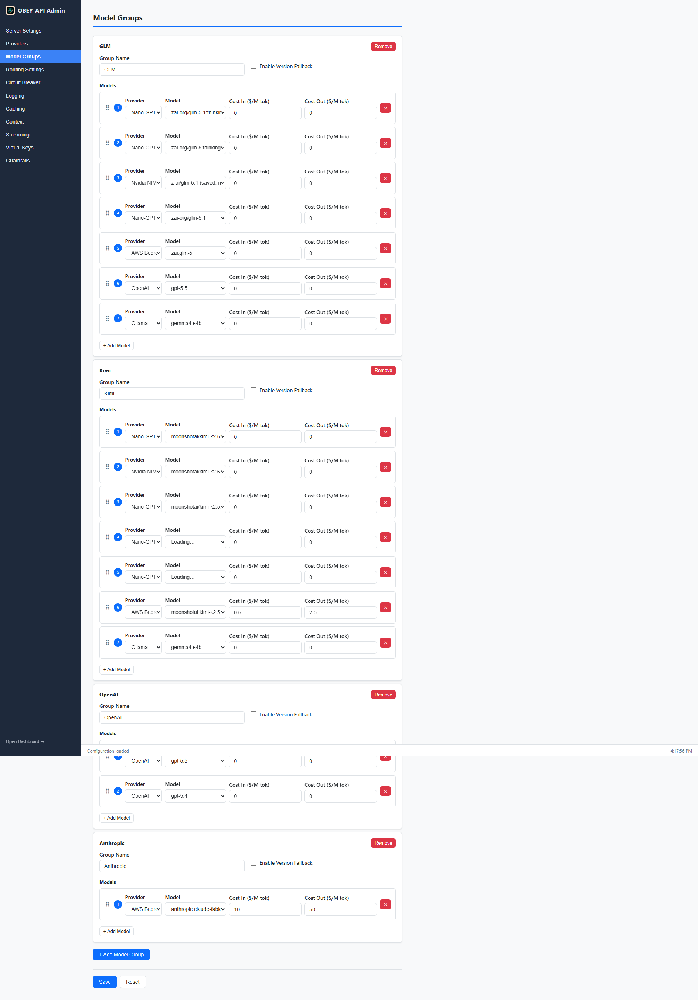
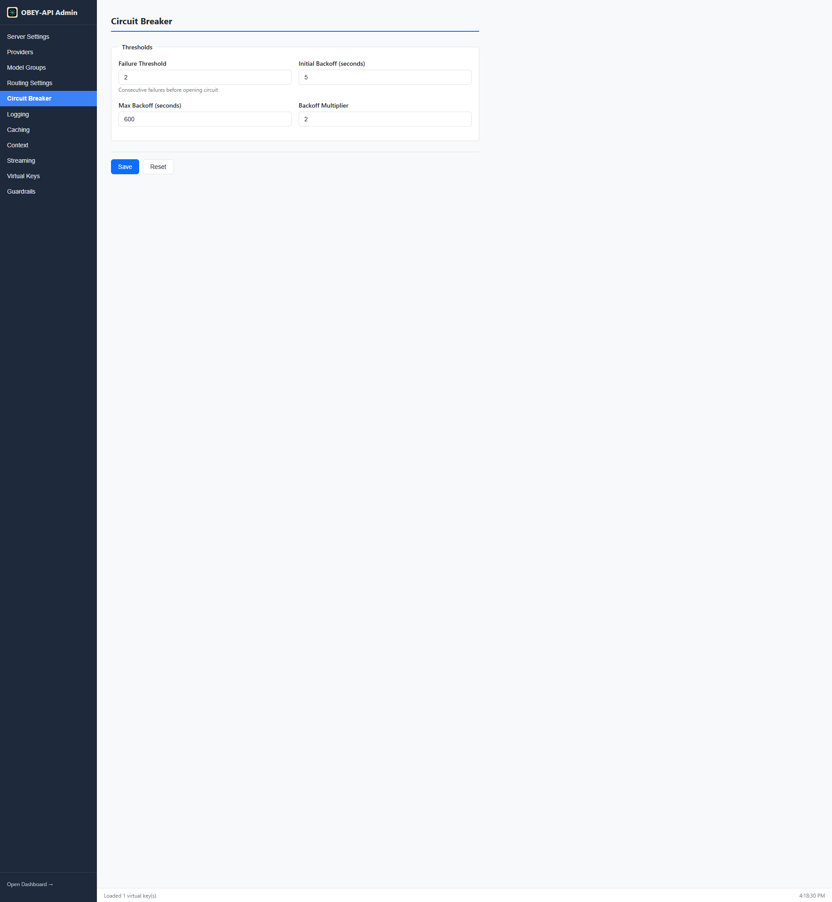

# Routing & Failover

OBEY API Gateway's core strength is intelligent request routing with automatic failover. When a provider fails, the gateway transparently tries the next one — your application never notices.

---

## How Routing Works

1. **Client sends a request** with a model name (e.g., `gpt-4-group`)
2. **Gateway resolves the model group** matching that name
3. **Models within the group are sorted** by priority (lower = higher priority)
4. **Router checks each candidate** in order:
   - Is the circuit breaker closed (healthy)?
   - Is the provider within its rate limit?
   - What's the current latency?
5. **Request is forwarded** to the first eligible provider
6. **On failure**, the next provider in the fallback chain is tried

```
Client Request → Model Group Resolution → Priority Sorting
                                              │
                    ┌─────────────────────────┼────────────────────────┐
                    ▼                         ▼                        ▼
              Provider A               Provider B                Provider C
            (priority: 1)            (priority: 2)             (priority: 3)
              ┌─────┐                  ┌─────┐                  ┌─────┐
              │ CB  │                  │ CB  │                  │ CB  │
              │Check│                  │Check│                  │Check│
              └──┬──┘                  └──┬──┘                  └──┬──┘
                 │                        │                        │
              [Success] ──────────────────────────────────────▶ Response
                 │
              [Failure] ──▶ Try Provider B ──▶ Try Provider C ──▶ Error
```

---

## Model Groups

Model groups define equivalent models that can serve the same requests:

```yaml
model_groups:
  - name: "gpt-4-group"
    version_fallback_enabled: false
    models:
      - provider: "openai"
        model: "gpt-4"
        cost_per_million_input_tokens: 10.0
        cost_per_million_output_tokens: 30.0
        priority: 1                   # Highest priority (tried first)

      - provider: "ollama-local"
        model: "llama3"
        priority: 2                   # Fallback

      - provider: "together"
        model: "meta-llama/Meta-Llama-3-70B"
        priority: 3                   # Last resort
```

Clients reference the group name as the model:
```python
client.chat.completions.create(model="gpt-4-group", ...)
```

### Model Groups in the Admin UI



### Version Fallback

When `version_fallback_enabled: true`, the gateway tries older model versions before moving to different providers. Useful for models that frequently update.

---

## Circuit Breakers

Each provider has an independent circuit breaker that prevents repeated calls to failing providers.

```yaml
circuit_breaker:
  failure_threshold: 3              # Consecutive failures to trip
  backoff_sequence_seconds: [5, 10, 20, 40, 300]
  success_threshold: 1              # Successes to recover
```



### States

| State | Behavior |
|-------|----------|
| **Closed** | Normal operation — requests flow through |
| **Open** | Provider is marked unhealthy — requests skip immediately |
| **Half-Open** | After backoff period — one test request allowed |

### Backoff Sequence

After tripping, the circuit breaker waits progressively longer between recovery attempts:

```
Trip → 5s wait → test → fail → 10s wait → test → fail → 20s wait → ...
```

The sequence resets on successful recovery.

### Reset on Config Reload

All circuit breakers are cleared when configuration is reloaded via the admin API. This lets you manually recover a provider after fixing the underlying issue.

---

## Smart Rate-Limit Failover

The gateway detects rate limiting across multiple signal types and instantly fails over:

| Signal | Detection |
|--------|-----------|
| HTTP 429 | Standard rate limit response |
| Rate-limit-shaped 200 | Response body contains rate limit error despite 200 status |
| `Retry-After` header | Honored for cooldown duration |
| `X-RateLimit-Reset` header | Used to calculate cooldown |
| Anthropic ISO reset headers | Parsed for exact reset time |
| Weekly-quota providers | Per-provider cooldown overrides for providers like Nano-GPT |

When rate-limited, the provider is temporarily skipped (not circuit-broken) and requests route to the next provider immediately.

---

## Retry Policy

Failed requests are retried within a provider before failing over to the next:

```yaml
retry:
  max_retries_per_provider: 1       # Retries per provider
  backoff_sequence_seconds: [1, 2, 4]
```

Retries use exponential backoff and only trigger for transient errors (5xx, timeouts, network errors). Permanent errors (4xx) fail immediately.

---

## Priority & Cost-Aware Routing

Models within a group are sorted by `priority` (lower = higher priority). For equal-priority models, the gateway considers:

- **Cost** — `cost_per_million_input_tokens` and `cost_per_million_output_tokens` for budget-aware selection
- **Latency** — tracked per-provider for optimal response times
- **Provider health** — circuit breaker and rate limit status

```yaml
models:
  - provider: "openai"
    model: "gpt-4"
    cost_per_million_input_tokens: 10.0
    cost_per_million_output_tokens: 30.0
    priority: 1      # Primary

  - provider: "together"
    model: "meta-llama/Meta-Llama-3-70B"
    cost_per_million_input_tokens: 0.9
    cost_per_million_output_tokens: 0.9
    priority: 2      # Cheaper fallback
```

---

## Context Window Management

When a request exceeds a model's context window limit, the gateway automatically truncates messages to fit rather than failing with a context-length error. This ensures requests always have a chance of succeeding even with large conversation histories.

---

## Latency Tracking

The gateway maintains rolling latency statistics per provider. This data is:
- Used for routing decisions between equal-priority providers
- Displayed in the dashboard metrics
- Available via the Prometheus endpoint

### Provider Health in the Dashboard


---

## Error Aggregation

When all providers in a model group fail, the gateway returns an aggregated error showing each attempt:

```json
{
  "error": {
    "message": "All providers failed",
    "type": "gateway_error",
    "attempts": [
      {"provider": "openai", "error": "timeout after 30s"},
      {"provider": "ollama", "error": "connection refused"},
      {"provider": "together", "error": "rate limited (retry after 60s)"}
    ]
  }
}
```

---

## Next Steps

- [Streaming](Streaming) — how streaming works with failover
- [Providers](Providers) — configure your providers
- [Configuration](Configuration) — full config reference
