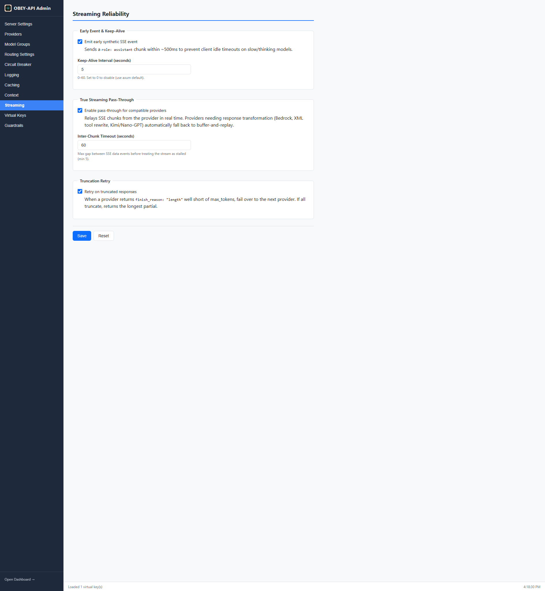

# Streaming

OBEY API Gateway provides robust streaming support that improves perceived reliability for slow/thinking models and flaky upstreams. When a client requests `stream: true`, a suite of reliability features activates automatically.

---

## Streaming Modes

The gateway operates in two streaming modes depending on provider capabilities:

| Mode | When Used | Behavior |
|------|-----------|----------|
| **True Pass-Through** | OpenAI-compatible providers | Upstream SSE chunks relayed in real time |
| **Buffer-and-Replay** | Bedrock, XML tool rewrite, Codex OAuth, token sanitization | Response buffered, transformed, then re-chunked as SSE |

Pass-through delivers the lowest latency; buffer-and-replay is used when the response needs transformation before delivery.

---

## Reliability Features

### Early Synthetic Event

Emits a `role: assistant` SSE chunk within ~500ms so clients don't idle-timeout while the model "thinks." This is especially useful for reasoning models (o1, o3, DeepSeek-R1) that may take 30-120 seconds before generating output.

- Skipped on cache hits (response starts immediately)
- Prevents HTTP client timeout errors in downstream applications

### Configurable Keep-Alive

Periodic SSE comment lines (`:`-prefixed) keep client connections alive during long generations:

```
: keep-alive

data: {"choices":[{"delta":{"content":"..."}}]}
```

This prevents proxies, load balancers, and HTTP clients from closing the connection during extended model reasoning.

### True Streaming Pass-Through

For OpenAI-compatible providers, upstream SSE chunks are relayed token-by-token with no buffering overhead. This delivers sub-second time-to-first-token (TTFT) for most models.

### Graceful Error Frames

When timeouts or mid-stream failures occur, the gateway surfaces them as proper SSE events rather than silent disconnects:

```
data: {"error":{"message":"Inter-chunk timeout after 60s","type":"stream_error"}}

data: [DONE]
```

The client receives a clean error and a proper stream termination.

### Mid-Stream Failover

If a provider fails **before** any content reaches the client, the gateway transparently retries the request on the next provider in the failover chain. No duplicate role events are sent.

After content has already been sent to the client, failover is not possible — the gateway emits an error frame and closes the stream.

### Truncation Retry

A `finish_reason: "length"` response that stops well short of the requested `max_tokens` is treated as a truncation. The gateway:

1. Retries on the next provider in the fallback ordering
2. If every provider truncates, returns the longest partial response

---

## Configuration

All fields are optional with safe defaults:

```yaml
streaming:
  emit_early_event: true            # Synthetic role:assistant chunk before upstream responds
  keepalive_interval_seconds: 5     # 0–60; 0 disables (axum default)
  passthrough_enabled: true         # True SSE relay for capable providers
  chunk_timeout_seconds: 60         # Max gap between SSE chunks (min 5)
  retry_on_truncation: true         # Failover on suspicious finish_reason=length
```

### Admin UI



---

## Timeout Behavior During Streaming

| Timeout | Trigger | Result |
|---------|---------|--------|
| TTFB timeout | No first byte from provider | Failover to next provider |
| Inter-chunk timeout | Gap between SSE chunks exceeds `chunk_timeout_seconds` | Error frame + stream close |
| Total timeout | Overall request duration exceeded | Error frame + stream close |

---

## XML Tool Call Detection

Some models emit XML-style tool calls instead of native `tool_calls` JSON. The gateway learns which `provider::model` combinations do this at runtime:

1. First streaming request detects XML tool syntax in pass-through mode
2. Combination is recorded in an in-memory set
3. Subsequent tool requests for that combo use buffer-and-replay to rewrite XML into native `tool_calls`

This set resets on process restart — it's a runtime optimization only.

---

## Interaction with Caching

Streaming responses are cached at the same tier as non-streaming responses. The cache key deliberately **excludes** the `stream` flag, so:

- A cached non-streaming response can be replayed as SSE chunks to a streaming client
- A streaming response, once assembled, can serve a non-streaming client
- The dashboard "Cache Hit Rate" reflects hits across both call styles

---

## Next Steps

- [Routing & Failover](Routing-and-Failover) — how failover decisions are made
- [Caching](Caching) — how caching interacts with streaming
- [Configuration](Configuration) — full config reference
