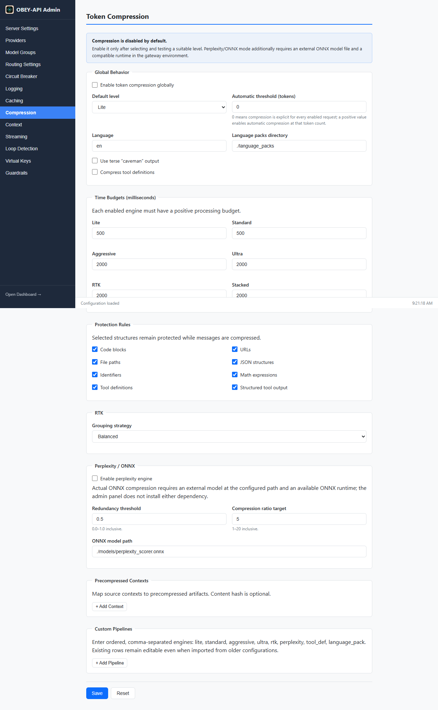
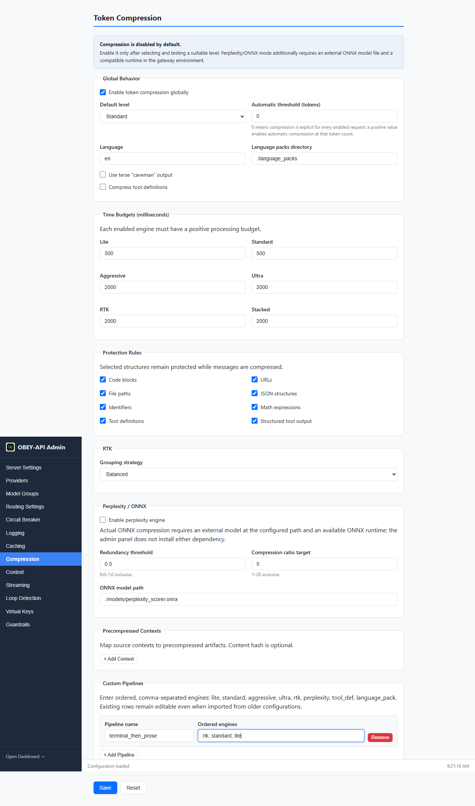

# Token Compression

OBEY API Gateway includes a multi-engine token compression system that transparently reduces request payload sizes before forwarding to providers. This cuts token consumption and costs, especially for applications with large conversation histories, repetitive content, or verbose tool definitions.

Token compression is **opt-in** and defaults to `disabled`. When enabled, it runs as Tower middleware on the request path, after guardrails and before provider dispatch.

---

## How It Works

```
Request ──▶ Protection Rules (preserve code, URLs, JSON, etc.)
                │
                ▼
         Engine Pipeline (ordered by compression level)
                │
                ▼
         Time Budget Check (abort if over budget)
                │
                ▼
         Cache-Aware Downgrade (preserve prompt-cache prefixes)
                │
                ▼
         Compressed Request ──▶ Provider
```

1. **Protection rules** identify content that must never be compressed (code blocks, URLs, JSON structures, identifiers, etc.) and mark those regions as exempt.
2. **Engine pipeline** runs one or more compression engines in sequence based on the resolved compression level.
3. **Time budget** ensures compression never exceeds a configurable per-level millisecond budget; if time runs out, partial results are used.
4. **Cache-aware downgrade** detects `cache_control` markers (Anthropic Claude) and preserves the cached prefix byte-for-byte, only compressing the suffix.

---

## Compression Engines

The system ships with 8 named engines that can be composed into levels or custom pipelines:

| Engine | Strategy | Best For |
|--------|----------|----------|
| `lite` | Light whitespace normalization and redundancy removal | Single-turn, short requests |
| `standard` | Balanced semantic compression preserving meaning | Multi-turn conversations |
| `aggressive` | Structure removal, whitespace stripping, abbreviation | Long contexts where some formatting loss is acceptable |
| `ultra` | Maximum compression, removes all non-essential tokens | Cost-sensitive batch processing |
| `rtk` | Round-trip-knowledge: semantic grouping with balanced/aggressive/conservative strategies | Preserving meaning while maximizing savings |
| `perplexity` | ONNX perplexity-scored redundancy removal | Long-context models, research workloads |
| `tool_def` | Schema minification for tool/function definitions | Requests with many tool definitions |
| `language_pack` | Language-aware compression using external language pack files | Non-English or multilingual content |

### Named Levels

Named levels resolve to ordered engine chains:

| Level | Engine Chain | Typical Savings |
|-------|-------------|-----------------|
| `none` | No compression | 0% |
| `lite` | lite | 5-15% |
| `standard` | standard | 15-30% |
| `aggressive` | aggressive | 30-50% |
| `ultra` | ultra | 50-70% |
| `rtk` | rtk | 40-60% |
| `stacked` | rtk + standard | 50-70% (highest, slowest) |

---

## Admin UI

Configure compression from the admin panel's **Compression** tab. The page opens with compression disabled and every field at its default value.



The page is grouped into sections — Global Behavior, Time Budgets, Protection Rules, RTK, Perplexity / ONNX, Precompressed Contexts, and Custom Pipelines — each mapping directly to the YAML keys documented below.

### UI Setup

1. **Enable globally** — tick **Enable token compression globally** under *Global Behavior*.
2. **Pick a default level** — `None`, `Lite`, `Standard`, `Aggressive`, `Ultra`, `RTK`, or `Stacked`. `Standard` is a balanced starting point for multi-turn conversations.
3. **Set an automatic threshold (optional)** — leave `0` to compress only when a request explicitly opts in, or enter a positive token count to auto-compress larger requests.
4. **Adjust time budgets (optional)** — each enabled engine needs a positive millisecond budget; heavier levels default to `2000` ms and the light levels to `500` ms.
5. **Review protection rules** — keep structured content (code blocks, URLs, file paths, JSON, identifiers, math, tool definitions) checked so it is preserved verbatim.
6. **Add a custom pipeline (optional)** — click **+ Add Pipeline**, give it a name, and enter ordered, comma-separated engines (for example `rtk, standard, lite`).
7. **Save** — click **Save**. Changes apply via hot reload; no restart is required.

The screenshot below shows compression enabled with the `Standard` default level and a custom `terminal_then_prose` pipeline defined:



> **Perplexity / ONNX:** Enabling the perplexity engine also requires an external ONNX model at the configured path and a compatible ONNX runtime in the gateway environment. The admin panel does not install either dependency.

---

## Configuration

### Global Settings

```yaml
compression:
  enabled: false                         # Enable compression globally (default: false)
  default_level: lite                    # Default compression level
  auto_threshold_tokens: 0              # Auto-trigger above this token count; 0 = disabled
  caveman_output: false                  # Collapse output to extreme brevity
  compress_tool_definitions: false       # Also compress tool/function definitions
  language: en                           # Language for language_pack engine
  language_packs_dir: ./language_packs   # Directory for language pack files
  time_budget_ms:                        # Per-level time budgets (milliseconds)
    lite: 500
    standard: 500
    aggressive: 2000
    ultra: 2000
    rtk: 2000
    stacked: 2000
  protection_rules:                      # Content patterns never compressed
    - code_blocks
    - urls
    - file_paths
    - json_structures
    - identifiers
    - math_expressions
    - tool_definitions
    - structured_tool_output
  precompressed_contexts: []            # Pre-compressed file mappings
  rtk:
    grouping_strategy: balanced         # aggressive | balanced | conservative
  perplexity:
    enabled: false                       # Requires ONNX perplexity scorer model
    redundancy_threshold: 0.5           # 0.0-1.0; higher = less aggressive
    compression_ratio_target: 5         # 1-20
    model_path: ./models/perplexity_scorer.onnx
  custom_pipelines: {}                  # Named custom engine chains
```

### Per-Provider Override

```yaml
providers:
  - name: "openai"
    type: "openai"
    base_url: "https://api.openai.com/v1"
    api_key_env: "OPENAI_API_KEY"
    compression:
      enabled: true                     # Override: enable for this provider
      level: standard                   # Override: use standard level
      auto_threshold_tokens: 2000       # Override: auto-trigger at 2000 tokens
      caveman_output: false
```

Setting `level: none` on a provider explicitly disables compression for that provider regardless of the global setting.

### Per-Model-Group Override

```yaml
model_groups:
  - name: "gpt-4-group"
    models:
      - provider: "openai"
        model: "gpt-4"
        priority: 1
    compression:
      level: aggressive                 # Override: aggressive for expensive models
      auto_threshold_tokens: 1000       # Override: lower threshold
      caveman_output: true
```

### Resolution Order

Configuration resolves per-field (not all-or-nothing):

```
Global defaults
  └── Provider override (if set)
        └── Model-group override (if set) ← wins
```

Each field resolves independently. A model-group can override `level` while inheriting `auto_threshold_tokens` from the provider.

---

## Custom Pipelines

Define named pipelines that chain engines in any order:

```yaml
compression:
  custom_pipelines:
    terminal_then_prose:
      engines: [rtk, standard, lite]
    tools_focused:
      engines: [tool_def, lite]
```

Callers select a custom pipeline via the `x-compression-pipeline` request header:

```bash
curl http://localhost:8080/v1/chat/completions \
  -H "x-compression-pipeline: terminal_then_prose" \
  -H "Content-Type: application/json" \
  -d '{"model":"gpt-4-group","messages":[...]}'
```

Engine names must be from the known set: `lite`, `standard`, `aggressive`, `ultra`, `rtk`, `perplexity`, `tool_def`, `language_pack`.

---

## Protection Rules

Protection rules prevent compression from damaging structured or sensitive content. The following rules are enabled by default:

| Rule | Protects |
|------|----------|
| `code_blocks` | Fenced code blocks (``` markers) |
| `urls` | HTTP/HTTPS URLs |
| `file_paths` | File system paths |
| `json_structures` | JSON objects and arrays |
| `identifiers` | Variable names, function names, class names |
| `math_expressions` | Mathematical notation and formulas |
| `tool_definitions` | Tool/function definition schemas |
| `structured_tool_output` | Structured output from tool calls |

Protected regions are passed through verbatim regardless of compression level.

---

## Cache-Aware Downgrade

When a provider supports prompt caching (e.g., Anthropic Claude with `cache_control` markers), the gateway automatically detects cached prefixes and:

1. Preserves the cached prefix byte-for-byte (no compression applied)
2. Compresses only the suffix (new content after the cache boundary)
3. Downgrades aggressive/ultra/rtk/stacked levels to `none` for the protected prefix

This ensures prompt cache hits are never invalidated by compression.

---

## Pre-Compressed Contexts

For large, static context documents (system prompts, documentation, etc.), you can pre-compress them offline and map the original to the compressed version:

```yaml
compression:
  precompressed_contexts:
    - source_path: ./docs/system-prompt.md
      compressed_path: ./docs/system-prompt.compressed.md
      content_hash: "sha256:abc123..."    # Optional: verify freshness
```

When the gateway detects a message matching the source content, it substitutes the pre-compressed version directly, skipping runtime compression entirely.

---

## RTK Engine

The RTK (Round-Trip-Knowledge) engine uses semantic grouping to compress content while preserving meaning. It supports three grouping strategies:

| Strategy | Behavior |
|----------|----------|
| `aggressive` | Maximum grouping, highest compression, may lose nuance |
| `balanced` (default) | Good compression with reliable meaning preservation |
| `conservative` | Minimal grouping, lowest compression, highest fidelity |

```yaml
compression:
  rtk:
    grouping_strategy: balanced
```

---

## Perplexity Engine

The perplexity engine uses an ONNX neural model to score token redundancy and remove low-information content. It requires a pre-trained perplexity scorer model file.

```yaml
compression:
  perplexity:
    enabled: false
    redundancy_threshold: 0.5           # Tokens below this perplexity are candidates for removal
    compression_ratio_target: 5         # Target ratio (1-20); higher = more aggressive
    model_path: ./models/perplexity_scorer.onnx
```

> **Note:** The perplexity engine is disabled by default and requires downloading or training a compatible ONNX model. Without it, perplexity-based compression is skipped silently.

---

## Observability

Compression metrics are exported via the `/metrics` Prometheus endpoint:

| Metric | Type | Labels | Description |
|--------|------|--------|-------------|
| `obey_compression_tokens_saved_total` | counter | `level`, `provider` | Cumulative tokens saved |
| `obey_compression_ratio` | histogram | `level`, `provider` | Compression ratio (compressed / original) |
| `obey_compression_duration_seconds` | histogram | `level`, `provider` | Compression operation duration |

### Structured Logging

Each compression operation produces a content-free stats record (never logs request/response content):

```json
{
  "request_id": "req_abc123",
  "level": "standard",
  "engines_applied": ["standard"],
  "original_tokens": 4200,
  "compressed_tokens": 2900,
  "savings_percent": 31.0,
  "compression_time_ms": 45,
  "auto_triggered": true,
  "cache_downgrade_applied": false,
  "tool_definitions_tokens_saved": 0,
  "caveman_applied": false,
  "timed_out": false,
  "error": false,
  "provider": "openai",
  "model": "gpt-4"
}
```

---

## Time Budget Enforcement

Each compression level has a configurable time budget. If compression exceeds the budget:

- The pipeline aborts remaining engines
- Partial results (from completed engines) are used
- The `timed_out` field is set to `true` in stats
- No error is returned to the caller; the request proceeds with whatever compression was achieved

Default budgets:

| Level | Budget |
|-------|--------|
| lite | 500ms |
| standard | 500ms |
| aggressive | 2000ms |
| ultra | 2000ms |
| rtk | 2000ms |
| stacked | 2000ms |

---

## Auto-Trigger Mode

When `auto_threshold_tokens` is set to a non-zero value, compression activates automatically for requests exceeding that token count, even if the caller didn't explicitly request compression:

```yaml
compression:
  enabled: true
  auto_threshold_tokens: 4000    # Compress requests > 4000 tokens automatically
  default_level: standard
```

This is useful for catching unexpectedly large requests without requiring client-side changes.

---

## Caveman Output Mode

When `caveman_output: true` is set, the gateway appends an instruction to the system prompt requesting extremely brief, compressed output from the model. This reduces response token consumption at the cost of prose quality.

This can be set globally, per-provider, or per-model-group.

---

## Hot Reload

Compression configuration participates in hot reload via `/admin/config/reload`. Changes to:
- Enabled state
- Default level
- Time budgets
- Protection rules
- Custom pipelines
- RTK/perplexity settings

...all take effect immediately without restart. Invalid configurations are rejected atomically (the previous config remains active).

---

## Next Steps

- [Configuration](Configuration) — full config reference
- [Caching](Caching) — how caching interacts with compression
- [Virtual Keys](Virtual-Keys) — per-key compression overrides (coming soon)
- [Streaming](Streaming) — compression applies before streaming begins
