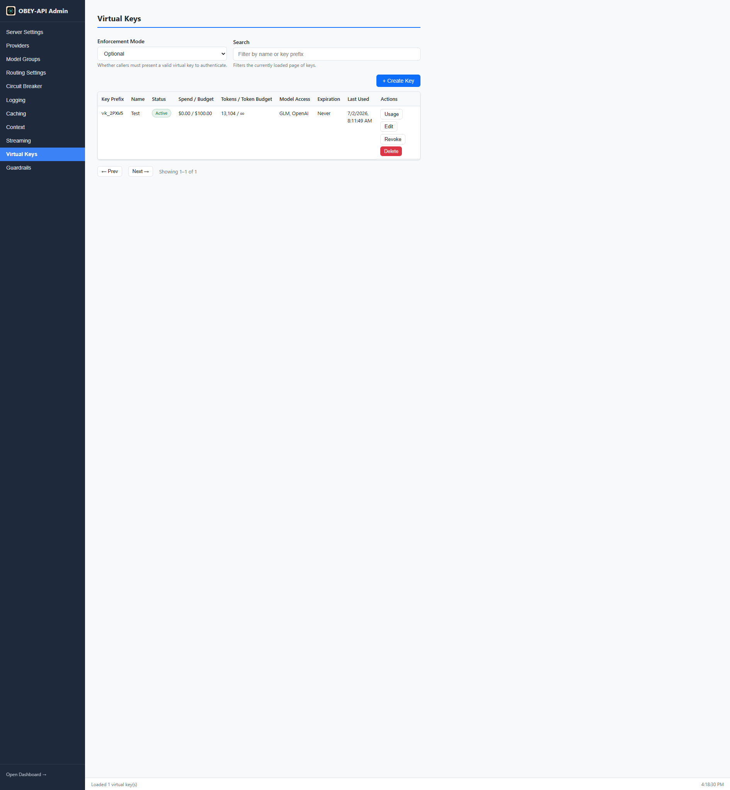

# Virtual Key Management

Virtual keys (`vk_…`) authenticate individual callers to the gateway without sharing real provider credentials. Each key carries its own budgets, rate limits, model-access rules, and expiry — all enforced at the proxy layer before requests reach upstream providers.

---

## Why Virtual Keys?

- **Multi-tenant usage tracking** — see who's spending what
- **Cost control** — per-caller USD and token budgets with automatic enforcement
- **Access governance** — restrict which model groups a caller can use
- **Credential isolation** — callers never see your real provider keys
- **Revocation** — instantly disable a compromised key without rotating provider secrets

---

## Enforcement Modes

Enforcement is opt-in and defaults to `disabled`:

```yaml
virtual_keys:
  enforcement: disabled       # disabled | optional | required
  database_path: "./keys.db"  # Dedicated key/usage store (SQLite)
```

| Mode | Behavior |
|------|----------|
| `disabled` (default) | Virtual keys are ignored; requests route with provider keys directly |
| `optional` | Requests with a `vk_` bearer token are validated and tracked; requests without one pass through |
| `required` | Every proxied request must present a valid virtual key (else `401`) |

---

## Enforcement Pipeline

The pipeline runs in order for each request:

```
Authenticate → Model Access → Budget Check → Rate Limit → Forward → Record Usage
```

1. **Authenticate** — validate the `vk_` token exists and isn't expired/revoked
2. **Model Access** — check the requested model against the key's whitelist
3. **Budget Check** — verify USD/token spend hasn't exceeded limits
4. **Rate Limit** — enforce RPM/TPM token buckets
5. **Forward** — route to provider
6. **Record Usage** — capture spend and tokens from the provider response

---

## Per-Key Constraints

| Constraint | Description | Enforcement |
|------------|-------------|-------------|
| `budget_limit_usd` | Cumulative USD spend cap (`0.01`–`999,999,999.99`) | `429` when reached |
| `token_budget` | Cumulative token cap (input + output) | `429` when reached |
| `budget_window` | `daily` / `weekly` / `monthly` reset window (omit for lifetime) | Auto-resets |
| `requests_per_minute` | Per-key RPM token-bucket | `429` + `Retry-After` |
| `tokens_per_minute` | Per-key TPM rolling 60s window | `429` + `Retry-After` |
| `model_access` | Whitelist of model group names (omit = allow all) | `403` on denial |
| `expires_in` | `never`, `1_year`, `6_months`, `3_months`, `1_month`, `2_weeks`, `1_week`, `3_days`, `1_day` | `401` after expiry |

---

## Admin API

Virtual keys are managed through the admin API (protected by admin auth):

```bash
# Create a key (returns the full vk_ value exactly once)
curl -X POST http://localhost:8080/admin/keys \
  -H 'Content-Type: application/json' \
  -d '{"name":"team-a","budget_limit_usd":50,"budget_window":"monthly","requests_per_minute":60}'

# List all keys
curl http://localhost:8080/admin/keys

# Inspect a specific key
curl http://localhost:8080/admin/keys/{id}

# Update constraints
curl -X PATCH http://localhost:8080/admin/keys/{id} \
  -H 'Content-Type: application/json' \
  -d '{"budget_limit_usd":100}'

# Revoke (key becomes unusable immediately)
curl -X POST http://localhost:8080/admin/keys/{id}/revoke

# Delete permanently
curl -X DELETE http://localhost:8080/admin/keys/{id}

# Per-key usage over a time range
curl "http://localhost:8080/admin/keys/{id}/usage?start=2024-01-01T00:00:00Z&end=2024-01-31T23:59:59Z"
```

---

## Admin Panel UI

The **Virtual Keys** tab provides a complete management interface:



Features:
- Searchable/sortable key table with budget and expiry warnings
- Create/edit forms with all constraint options
- One-time key reveal on creation
- Revoke/delete confirmations
- 30-day per-key usage chart

---

## Caller Usage

Callers authenticate with the issued key as a Bearer token:

```bash
curl http://localhost:8080/v1/chat/completions \
  -H "Authorization: Bearer vk_your_key_here" \
  -H "Content-Type: application/json" \
  -d '{"model":"gpt-4-group","messages":[{"role":"user","content":"Hello!"}]}'
```

```python
from openai import OpenAI

client = OpenAI(
    base_url="http://localhost:8080/v1",
    api_key="vk_your_key_here"  # Virtual key as API key
)
```

---

## Storage

Virtual keys are stored encrypted in a dedicated SQLite database (`keys.db`), separate from request logs. The full `vk_` token value is shown exactly once at creation time and cannot be recovered afterward.

---

## Interaction with Guardrails

When both virtual keys and [guardrail pipelines](Guardrail-Pipelines) are active, pipelines can be bound to specific virtual keys:

```yaml
guardrails:
  bindings:
    virtual_keys:
      vk_team_a: standard
      vk_external: strict-pii
```

This allows different policy enforcement per caller.

---

## Next Steps

- [Guardrail Pipelines](Guardrail-Pipelines) — policy enforcement per key
- [Security](Security) — key encryption details
- [Admin Panel & Dashboard](Admin-Panel-and-Dashboard) — usage monitoring
